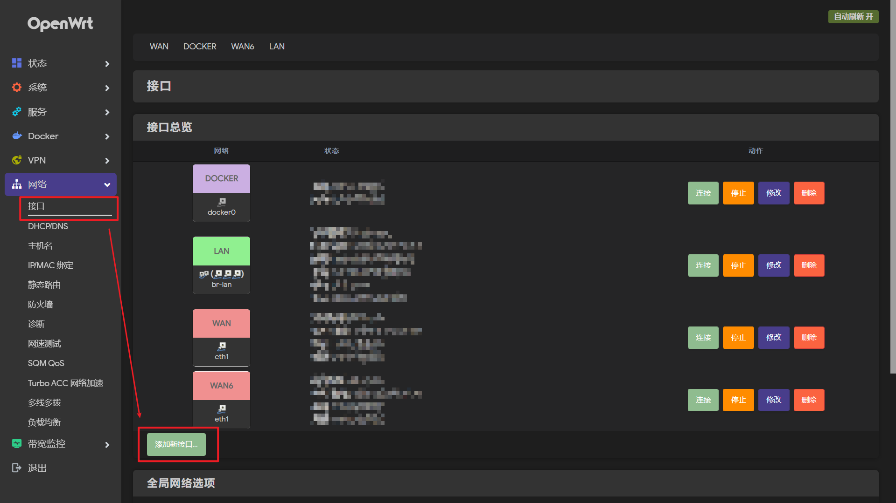
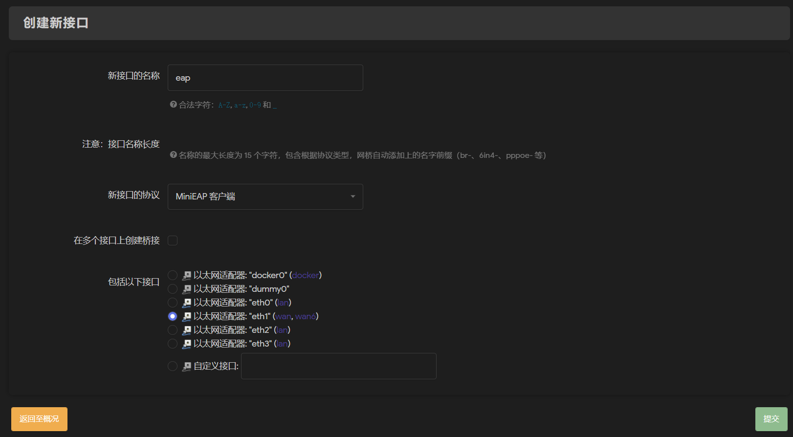
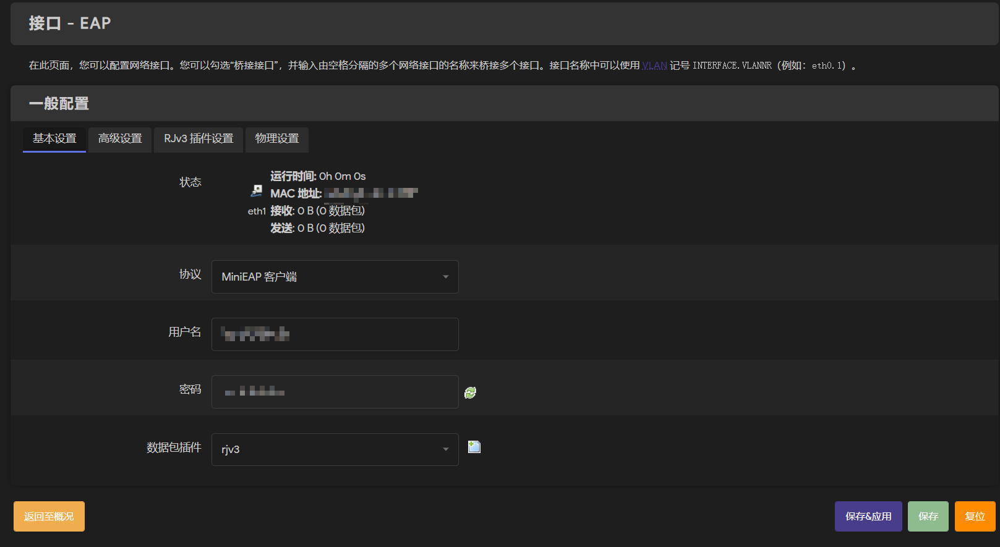
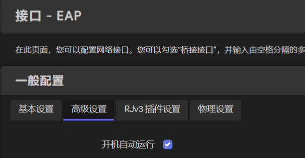
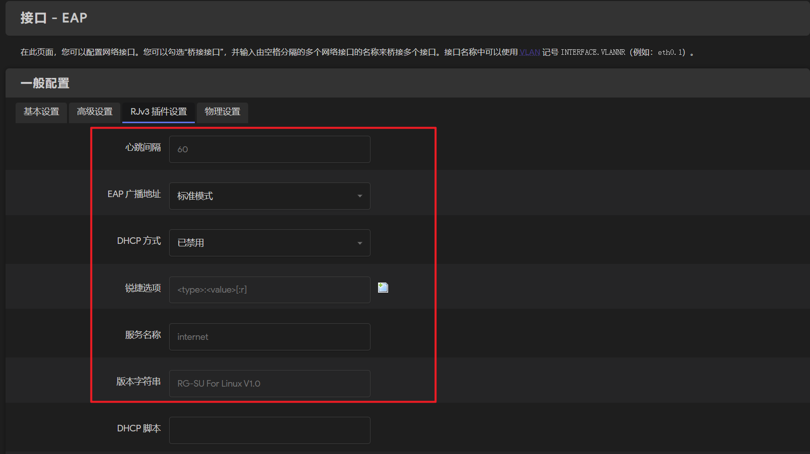
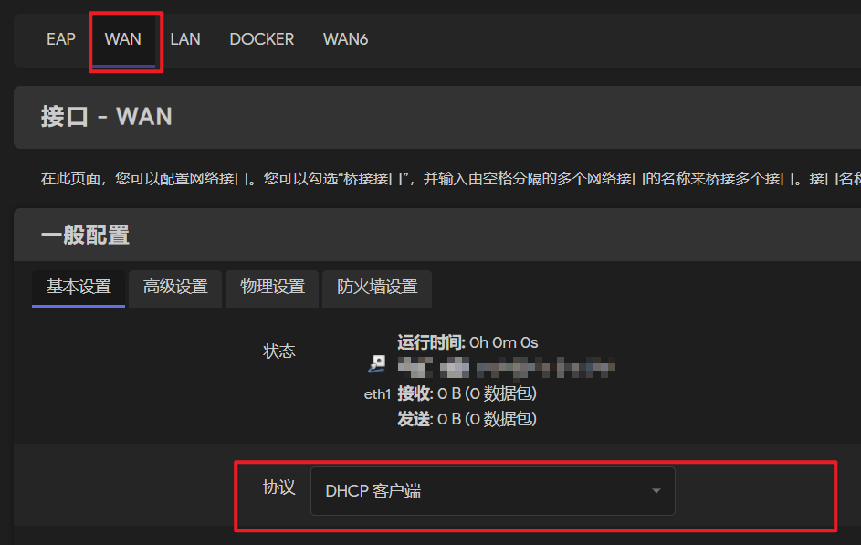
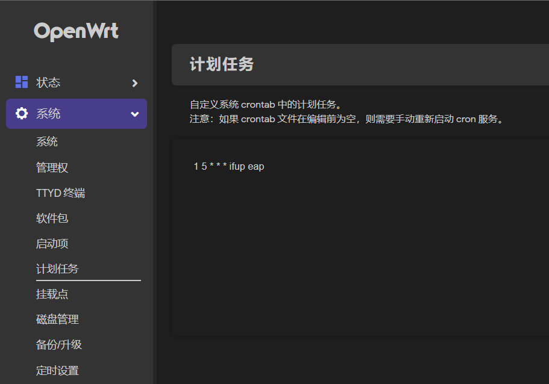

# MiniEAP 在 OpenWRT 上的使用

## Step-1 安装相关插件

请在固件中编译/安装以下插件：

- `openwrt-minieap`：MiniEAP 的认证程序
	- 原版：[ysc3839/openwrt-minieap](https://github.com/ysc3839/openwrt-minieap)
	- 如果原版无法在自己的校园网环境内正常工作，你可能需要安装适配自己学校的修改版（如 [jimlee2002/openwrt-minieap-gdufs](https://github.com/jimlee2002/openwrt-minieap-gdufs)）。可以在 Github 上搜索是否存在已有项目。
	- **注意：** 安装修改版前，请确保编译取消勾选/卸载已安装的原版 `minieap`
- `luci-proto-minieap`：在 OpenWRT 管理网页（Luci）用于配置 MiniEAP 的相关前端界面。
	- [ysc3839/openwrt-minieap](https://github.com/ysc3839/luci-proto-minieap)
	- [jimlee2002/luci-proto-minieap](https://github.com/jimlee2002/luci-proto-minieap)：如果在官方最新 OpenWRT 上使用时，遇到了不显示中文配置界面的问题，你可以尝试我的这个 fork。
	  问题详情请参见 [Add symbolic link for i18n to support the latest Luci by jimlee2002 · Pull Request #2 · ysc3839/luci-proto-minieap · GitHub](https://github.com/ysc3839/luci-proto-minieap/pull/2)

> **对于 GDUFS 用户：**
> 如果你使用的是 `x86_64` 平台的软路由，笔者已经预编译好了所需插件。请确保已卸载原版 `minieap` 后，下载并安装 [这里](https://github.com/jimlee2002/openwrt-minieap-gdufs/releases/tag/v0.93-5_gdufs) 的所有 `ipk` 插件包到固件。

## Step-2 设置认证用网络接口

前往 ` 网络` -> ` 接口 `，点击 ` 添加新接口……`



新接口配置信息如下：

- 名称：可自选，建议设为 `eap`，本文后续以该接口名为例
- 协议：MiniEAP 客户端
- 接口：`wan` 口所在的以太网适配器

保存接口配置，来到刚才新建接口 `eap` 的设置页面：
- 输入自己校园网的账号和密码
- 数据包插件选择 `rjv3`
- 左下角点击保存


进入 ` 高级设置`，确保 ` 开机自动运行` 勾选上：



进入 `RJv3 插件设置`，填写符合校园网环境的配置参数：



>如果你使用了 [openwrt-minieap-gdufs](https://github.com/jimlee2002/openwrt-minieap-gdufs)，下面配置中的大部分参数已经设置为默认值了，只需在该界面设置“EAP 广播地址”和“服务名称”两项参数即可。

> **GDUFS** 参考配置：
> - 心跳间隔：`60`
> - EAP 广播地址：` 锐捷私有 `
> - DHCP 方式：` 二次认证 `
> - 服务名称：`default`
> - 版本字符串：`RG-SU For Linux V1.30`

检查无误后，点击 ` 保存&应用 ` 完成新接口设置。

回到接口主界面，检查下 `wan` 接口的协议是否已设为 `DHCP 客户端`



确认一切无误后，插好你的网线，点击 `eap` 接口的 `连接` 按钮。

然后打开 `状态` -> ` 系统日志 `，拉到日志最底看看有没有认证成功的提示，类似下面这样：

```
[I] ========================
[I] MiniEAP 0.93已启动
[I] 正在查找认证服务器
[I] 正在回应用户名请求
[I] 正在回应密码请求
[I] 首次认证成功，正在执行 DHCP 脚本以准备第二次认证
[E] IPv4 地址获取错误
[W] DHCP 可能尚未完成，将继续等待……
[I] 认证成功
[I] DHCP 完成，正在开始第二次认证
[I] 正在查找认证服务器
[I] 正在回应用户名请求
[I] 正在回应密码请求
[I] 二次认证成功
[I] 服务器通知：
[I] ************
[I] 正定时发送 Keep-Alive 报文以保持在线……
[I] 认证成功
```

如果认证不成功，请检查你的接口配置。

如果接口设置无误但仍然无法通过验证，则可能意味着原版MiniEAP 的默认通用参数并不适配你学校的特殊网络环境，需要对MiniEAP 代码进行修改才能使用。你可以前往Github 搜索是否已有适配自己学校的修改版`MiniEAP`。

对于 [openwrt-minieap-gdufs](https://github.com/jimlee2002/openwrt-minieap-gdufs) 用户，还请确保 OpenWRT 内编译安装的是 `minieap-gdufs` 而非 `minieap`。

## Step-3 设置定时重启认证（可选）

一切配置妥当后，软路由每次开机都会通过设置好的认证接口 `eap` 自动使用 MiniEAP 进行认证。

在认证后的使用过程中：

- 如果不慎主动短时断连（如不小心碰到网线致使网口松动），在重新连接校园网后 MiniEAP 会自动恢复认证状态。
- 如果进入断网时段自动踢出认证/因认证服务器抽风等各种原因被系统主动踢出认证：MiniEAP 会在系统日志打印错误参数，并默认进行 3 次重连，3 次重连均失败后则~~开摆~~不再重试。
- 不建议修改默认的重连尝试次数，否则重试次数过多很可能会被认证服务器封号。

对于部分存在断网时段的校园网环境（如夜间断网），为避免夜间断网时段 MiniEAP 3 次重连失败~~自动开摆~~不再认证，需要设置在网络恢复的时间点重新发起认证。

以 GDUFS 为例：

- GDUFS 的断网时段为非假期工作日（周一至周五）凌晨 01:00 - 05:00
- 进入断网时段，会自动踢出校园网上设备的认证，同时禁止新设备发起认证
基于上述需求，这里的示例希望设置软路由在每天的凌晨 05:01 自动重新发起认证（多 1 分钟是为了避免踩点认证因时间不同步导致可能的失败问题）

前往 ` 系统` -> ` 计划任务 `，添加crontab 语句：

```
1 5 * * * ifup eap
```



语句解释：在每天05:01 重启接口`eap`

- `1 5 * * * `：指定计划任务时间的 crontab 表达式。请根据自己需要调整时间。
- `ifup eap`：重启认证用的接口 `eap`，接口每次重启时会重新发起认证。

## Step-4 关闭 IPv6（可选）

对于部分没有 IPv6 网络或者是 IPv6 网络无法正常使用的校园网环境，你还需要关闭 OpenWRT 的 IPv6 相关功能，否则会遇到上网问题（如知乎/微博图片无法加载）。

> 对于 **GDUFS**，校园网的 IPv6 当前无法正常使用，更多信息请参见 [Surf in GDUFS](https://github.com/jimlee2002/openwrt-minieap-gdufs/blob/master/docs/surf-in-gdufs.md#关于-IPv6)

要完全关闭 OpenWRT 的 IPv6 功能，请遵循以下操作：

- 网络 - 接口主面板，全局网络选项 - 清空 `IPv6 ULA 前缀 `
- 停用 wan6 接口，且关闭 ` 开机自动运行 `
- 关闭其他接口（wan、lan 等）的 ` 使用内置的 IPv6 管理 `
- Lan 接口设置下的 `dhcp 服务设置 ` -> `ipv6 设置 `：
	- 全部设为 ` 已禁用 `
	- 取消勾选 ` 总是通告默认路由 `
- ` 网络 ` -> `dns/dhcp` -> ` 高级设置` -> 禁止解析 IPv6 DNS 记录：Y
