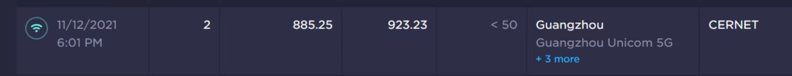

# Surf in GDUFS

以下信息基于南校区情况总结，截至 2022.07。

欢迎 Issues / Pull Request 补充纠错。

## 接入方式

- WiFi：
	- `GDUFS`：开放 WiFi，连接后会自动跳出/浏览器打开任意网站显示校园网认证网页。
	- `GDUFS_Auto`：连接时会要求输入账号名和密码。
- 有线：
	- 设备用网线连接宿舍个人桌下的网口。
	- 连接网线后使用认证客户端登录。
	- 认证客户端下载地址和使用说明：[校园网使用方法（含客户端软件下载及使用手册）](https://ns.gdufs.edu.cn/info/1045/1171.htm)

> 如非必要，不建议使用 WiFi 连接校园网，详见下文“接入方式”

## 网络带宽

### 外网带宽

外网带宽，指设备访问非校园网服务的外部网络服务时的带宽速度。受校园网存在的动态限速影响，以下数值均为基于实际测速观察的估算值，仅供参考。

#### 学生宿舍（南）

- 非高峰时段：
	- ✅2022 年后至今：下行 50-100Mbps / 上行 500Mbps-1Gbps
	- ❌2022 年以前：上下行对等 1Gbps
	  

- 高峰时段：（每天晚上）
	- 下行 10-50Mbps / 上行 30-50 Mbps
	- 可能伴随延迟增加

#### 教学区（南）

- 非高峰时段：上下行对等 50-100Mbps
- 高峰时段：下行 10-50Mbps / 上行 30-50 Mbps（同学生宿舍）

### 内网带宽

内网带宽，指校园网内设备进行内网交换的带宽速度。以下数值均为基于实际测速观察的估算值，仅供参考。

#### 南校区内部

**学生宿舍 <-> 学生宿舍：**

- 与临近学生宿舍（同属 1 个上层交换设备）：上下行对等 1Gbps
- 与同栋非临近学生宿舍/其他栋学生宿舍：上下行对等 100Mbps

**学生宿舍 <-> 教学区：** 上下行对等 100Mbps

#### 北校区内部

待测试，欢迎提供数据。

#### 南北校区互联

待测试，欢迎提供数据。

## 网络限制

- 上网前需要通过认证。
- 最多 2 台设备同时使用校园网（同时最多 2 台已认证设备）。
- 非假期的工作日期间，凌晨 01:00-05:00 会自动断网。

## 使用心得建议

- 不建议使用 WiFi 接入校园网：
	- WiFi 网络信号一般，校内无线漫游存在问题（在校园内移动到其他位置后有概率无法正常使用）
	- 连 WiFi 的人太多，普遍速度很慢，在人流集中区域还会出现连不上 WiFi 的情况（如图书馆、大型活动）
- 在宿舍区，电脑尽量使用有线网络接入校园网，可以用电脑开无线热点给手机/平板。
- 宿舍网口不能用，可以打电话/通过微信上的校园服务平台报修。
- 如果自己的电脑没有网线接口，可以网上买个网口拓展坞。不建议在校内购买网线/网口拓展坞。
- 离开宿舍后，条件允许的话建议手机全程使用流量上网，可以用手机开无线热点给平板/电脑用。需要访问内网服务资源等特殊情况时才连校园网 WiFi。
- 想接路由器？想玩软路由？
	- 在 OpenWRT 中过认证，你需要这个：[jimlee2002/openwrt-minieap-gdufs](https://github.com/jimlee2002/openwrt-minieap-gdufs)
	- 或者，你也可以参考这位前辈的转发方案 [广外校园网使用指北（大聪明版）- 是你猫兄啊](https://mp.weixin.qq.com/s/TzFLEV2xrQXJh5Fh14zzxQ)
- 善用学校提供的各种资源：[电子资源平台](https://librra.gdufs.edu.cn/ermsClient/browse.do)
- 部分校内资源和服务网站需要连校园网才能访问，如体测系统。
- 对于知网，设备在连接校园网后就会自动登录学校提供的知网账号。如果连不上校园网或者需要在校外访问，可以使用 [图书馆数字资源校外访问系统](https://lib.gdufs.edu.cn/fwzn/xwfw/tsgszzyxwfwxt.htm)
- 学校为每个学生免费提供了教育邮箱，在买电子产品/买各种软件服务时会很有用，能通过教育邮箱享受到学生专属的教育优惠。
- 注意按时缴纳网费。

## 关于 IPv6

**TL; DR**: GDUFS 有 IPv6 ，但目前无法正常使用。

根据学校官网新闻，GDUFS 校园网早在 2019 年就已经改造升级了 IPv6，见 [新闻1](https://www.gdufs.edu.cn/info/1106/52793.htm)、[新闻2](https://www.gdufs.edu.cn/info/1106/56032.htm)

同时，据往届学长描述，在 2018-2019 年的某段短暂时间内，GDUFS 的 IPv6 是可以正常使用的，通过校园网 IPv6 可以直接访问 Google，查阅谷歌学术资料非常方便。

然而，随后 GDUFS 校园网的 IPv6 就无法正常使用了，表现为认证后虽然能够获取到 IPv6 地址，但 IPv6 网络完全无法使用，表现为：

- 无法通过 <https://test-IPv6.com> 的测试
- Ping 不通任何 IPv6 服务器，也无法访问任何 IPv6 网站

上述情况能够在南校和北校的学生宿舍生活区稳定复现。

而对于教学区域，GDUFS 的 IPv6 则表现出了更为模棱两可的情况。笔者近年来一直在尝试在南校的教学楼/实验楼区域的设备上进行测试，表现为：

- 绝大部分区域的大多数时候，表现和上述生活区的情况一致，可以获取到 IPv6 地址但偶尔能够上网
- 部分实验楼区域偶尔能够通过 <https://test-IPv6.com> 的测试，但仍然无法访问任何 IPv6 网站/Ping 通任何 IPv6 服务
- 在 2022.04 左右的某段时间内，IPv6 曾一度能够在教学楼和实验楼设备上正常使用，不仅能完美通过 <https://test-IPv6.com> 的测试，也能正常访问 IPv6 网站（包括教育网内的专有 IPv6 资源网站如北邮人 PT）。但在约 1 个月后又恢复到先前的不可用状态。

笔者的朋友曾经以递交网络报修工单的形式联系过校方网信中心相关人员，网信中心一度表现出积极的态度，与我的朋友主动沟通联系，并派遣了一位运维人员来到宿舍实地复现问题，但随后便再无下文。时至今日，这条工单仍然保持为开启状态。

无论如何，可以确定的是，GDUFS 校园网已经配置了 IPv6，理论上是能够正常使用的。基于以上情况，笔者推测：可能是出于某些原因，学校主动禁止掉了校内所有设备 IPv6 的使用权限；又或者是校园网的网络基础设备关于 IPv6 的某些配置存在某些问题，导致了所有接入终端都无法正常使用 IPv6 网络。

如果你找到了正常使用校园网 IPv6 的方法，欢迎 Issue/Pull Request 补充本文章！
